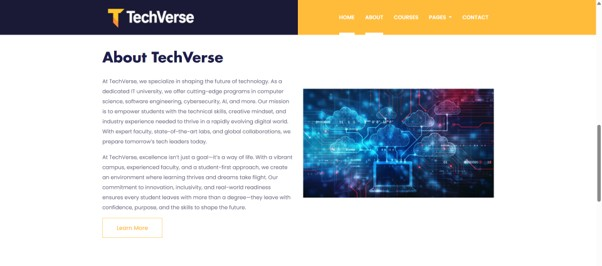
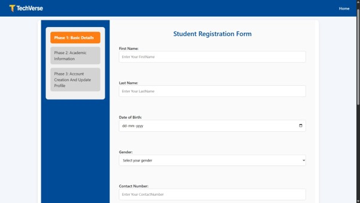
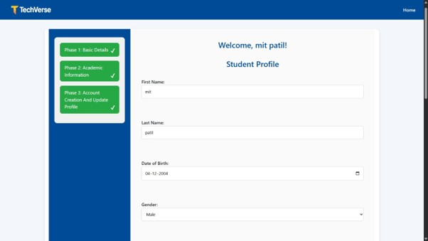
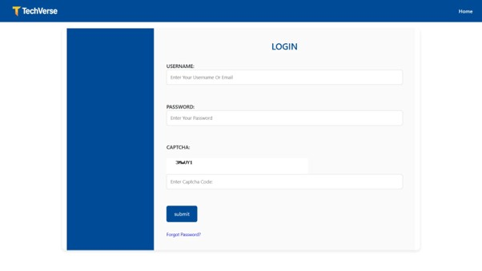
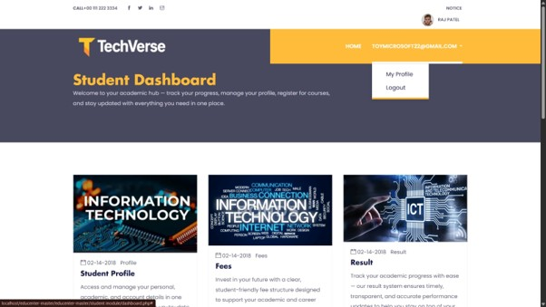
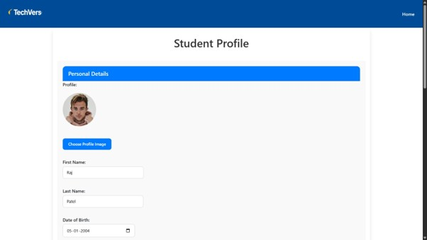
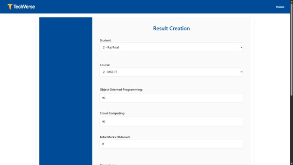
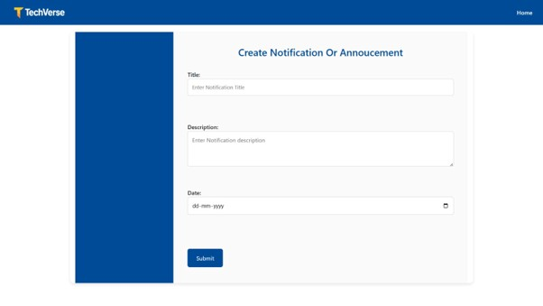
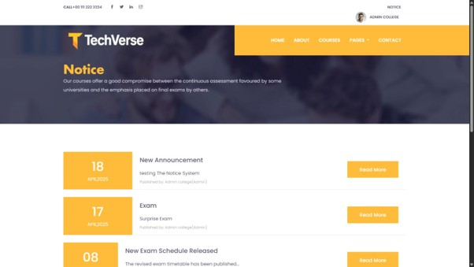
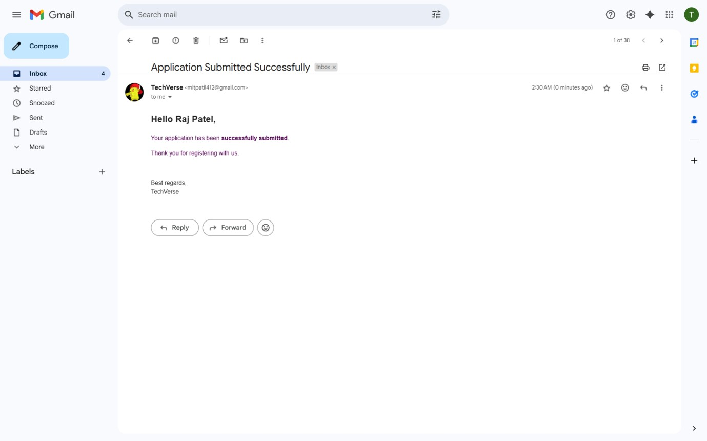

# TechVerse — Institute Management System

**Centralized Academic & Administrative Management**

TechVerse automates the day-to-day operations of an educational institute — student and faculty records, admissions, fee processing, result generation, and notices — through a single, role-based platform for Students, Faculty, and Admins.

---

## Table of Contents

- [Features](#features)
- [Tech Stack](#tech-stack)
- [Screenshots](#screenshots)
- [Getting Started](#getting-started)
- [Future Enhancements](#future-enhancements)

---

## Features

**Student** — Registration, login, profile view/edit, academic detail view, course enrollment, fee payment, and result viewing.

**Faculty** — Registration, login, profile view/edit, result generation with auto-calculated percentage/CGPA/grade, and student management.

**Admin** — Manage students, faculty, courses, subjects, and fee structures; upload institute-wide notices and announcements.

**Notices** — Admin/faculty can publish announcements; students and faculty view them on a shared notice board, with email notifications on publish.

**Authentication** — Role-based login (Student/Faculty/Admin) with CAPTCHA verification and forgot-password flow.

## Tech Stack

| Layer | Technology |
|---|---|
| Backend | PHP |
| Frontend | HTML, CSS, Bootstrap, JavaScript |
| Database | MySQL (via phpMyAdmin) |
| Email | PHPMailer (SMTP) |
| Server | Apache (XAMPP) |

## Screenshots

### Home Page

### About Us

### Courses

### Student Registration
| Phase 1: Basic Details | Final Step: Account & Profile |
|---|---|
|  |  |

### Login

### Student Dashboard & Profile
| Dashboard | Profile |
|---|---|
|  |  |

### Faculty Dashboard & Result Generation
| Dashboard | Result Generation |
|---|---|
|  |  |

### Admin Dashboard

### Notices
| Create Notice (Admin) | Notice Board (Public) |
|---|---|
|  |  |

### Email Notifications
Automated confirmation and notification emails are sent for registration, result publishing, and notices.

## Getting Started

### Prerequisites
- XAMPP (Apache + PHP + MySQL)
- Composer

### Setup

1. Clone or copy the project into your XAMPP `htdocs` folder:

2. Start Apache and MySQL from the XAMPP Control Panel.

3. Install PHP dependencies:

4. Open phpMyAdmin (`http://localhost/phpmyadmin`) and create a new database (e.g. `techverse_db or ims`).

5. Import the provided SQL schema/dump into that database.

6. Update database credentials in the config file (e.g. `connection.php`) to match your local setup.

7. Update SMTP/email credentials in the mail config with your own values.

8. Visit `http://localhost/educenter-master/educenter-master/` in your browser.

## Future Enhancements

- Online payment gateway integration for fee payments
- SMS/push notifications alongside email
- Attendance tracking module
- Analytics dashboard for admin (enrollment trends, fee collection, performance)
- Mobile-responsive redesign / native app

---

*Built by Mit Patil.*